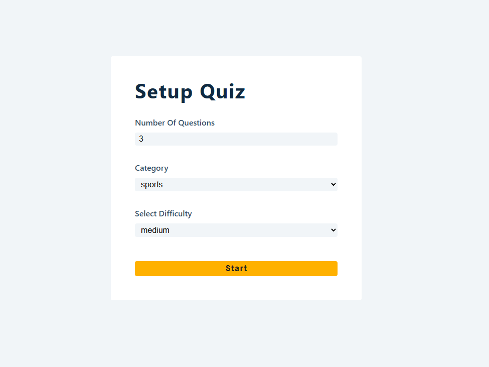

# 📝 Quiz App (React + Axios)

A dynamic and interactive **Quiz Application** built with **React**, fetching questions from an external **API** using **Axios**. Test your knowledge with real-time quizzes and track your score easily!

## 🛠️ Tech Stack

- **React** – UI Components and State Management  
- **Axios** – Fetching quiz data from API  
- **CSS** – Styling

## ✨ Features

✅ **Fetch Quiz Questions from API**  
✅ **Display Questions & Multiple Choices**  
✅ **Track and Update User Score**  
✅ **Show Final Score After Completion**  
✅ **Loading State While Fetching Data**  
✅ **Responsive Design**

## 📸 Preview

## 🚀 Live Demo

[🔗 View Live Demo](https://quiz-app155.netlify.app)